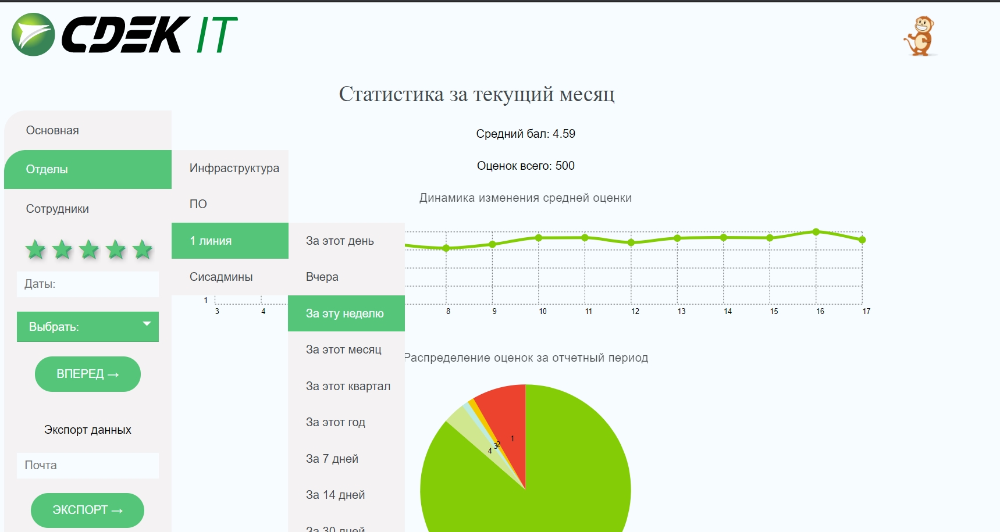

# <h3 align="center">Admin panel of NPS Feedback site front part</h3>

<p align="center">
 <a href="#">
    
</a>
</p>

## Short description
Front part of admin panel of NPS website:
https://nps.cdek.ru/


## What's included

```text
C:.
|   .babelrc
|   .gitignore
|   debug.log
|   package-lock.json
|   package.json
|   README.md
|   smart-grid-config.js
|   webpack.config.js
|
+---analog
|       QR_HostCall_Quality.jpg
|
+---dist
|   |   index.html
|   |   response.html
|   |   spec.html
|   |   stat.html
|   |
|   +---css
|   |       style.bundle.css
|   |       style.bundle.css.map
|   |
|   +---favicon
|   |       favicon.ico
|   |
|   +---img
|   |   +---icons
|   |   |       cd-icon-arrow-next.svg
|   |   |       cd-icon-select.svg
|   |   |       cd-icons-cart-close.svg
|   |   |
|   |   +---logos
|   |   |       footer_logo.png
|   |   |       logo.jpg
|   |   |       logo.svg
|   |   |       logo001.png
|   |   |       logo007.ico
|   |   |       logo1.png
|   |   |       logo12.jpg
|   |   |       logo12.png
|   |   |       oie_1705820ySJeWkaJ(1).png
|   |   |       red.png
|   |   |
|   |   \---products
|   |       \---arahis
|   |               arahis1.jpg
|   |               arahis2.jpg
|   |               arahis3.jpg
|   |
|   \---js
|           bundle.js
|           bundle.js.map
|
+---readme_img
|       img-1.jpg
|
\---src
    +---favicon
    |       favicon.ico
    |
    +---fonts
    +---html
    |   +---includes
    |   |       footer.html
    |   |       header.html
    |   |
    |   \---views
    |           index.html
    |           response.html
    |           spec.html
    |           stat.html
    |
    +---img
    |   +---icons
    |   |       cd-icon-arrow-next.svg
    |   |       cd-icon-select.svg
    |   |       cd-icons-cart-close.svg
    |   |
    |   \---logos
    |           red.png
    |
    +---js
    |   |   index.js
    |   |
    |   +---classes
    |   |       Chart.js
    |   |       CustomDateUser.js
    |   |       Export.js
    |   |
    |   +---functions
    |   |       exportComments.js
    |   |       main.js
    |   |       monkey.js
    |   |       news.js
    |   |       sendCustomDateUserFunc.js
    |   |       sleep.js
    |   |       sort-table.js
    |   |       toggleClass.js
    |   |
    |   \---vendors
    |           chartist-plugin-tooltip.js
    |           chartist.js
    |           custom-select.js
    |           datepicker.js
    |
    +---scss
    |   |   main.scss
    |   |
    |   +---abstracts
    |   |       _animations.scss
    |   |       _functions.scss
    |   |       _mixins.scss
    |   |       _variables.scss
    |   |
    |   +---base
    |   |       _base.scss
    |   |       _normalize.scss
    |   |       _reset.scss
    |   |       _typography.scss
    |   |       _utilities.scss
    |   |
    |   +---components
    |   |       _box.scss
    |   |       _buttons.scss
    |   |       _comments.scss
    |   |       _container.scss
    |   |       _custom-select.scss
    |   |       _error.scss
    |   |       _item.scss
    |   |       _list.scss
    |   |       _loader.scss
    |   |       _logo.scss
    |   |       _monkey.scss
    |   |       _nav-first.scss
    |   |       _nav.scss
    |   |       _rating-form.scss
    |   |       _response.scss
    |   |       _results.scss
    |   |       _side-nav.scss
    |   |       _stars.scss
    |   |       _users-table.scss
    |   |
    |   +---layout
    |   |       _footer.scss
    |   |       _header.scss
    |   |
    |   +---pages
    |   |       _index.scss
    |   |
    |   \---vendors
    |       |   _chartist-plugin-tooltip.scss
    |       |   _chartist.scss
    |       |   _datepicker.scss
    |       |
    |       \---chartist-settings
    |               chartist-settings.scss
    |
    \---uploads
```

## Bugs and feature requests

Have a bug or a feature request? Please send email to a.ochirov@cdek.ru or ochirovaur2@mail.ru
